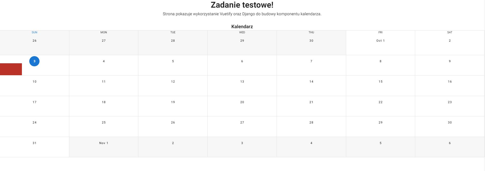
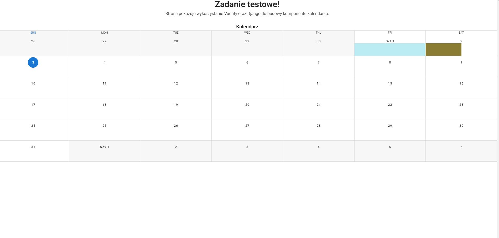
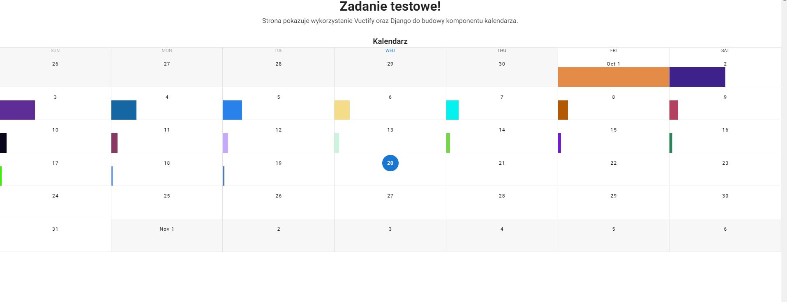

## Django and Vue.js based calendar app

The project does not use django-cookiecutter or DRF.\
Due to the scale of the project, this would be unjustified


### Run it

```
docker-compose up
```

and visit:

```
localhost:8080
```

#### Other variations


